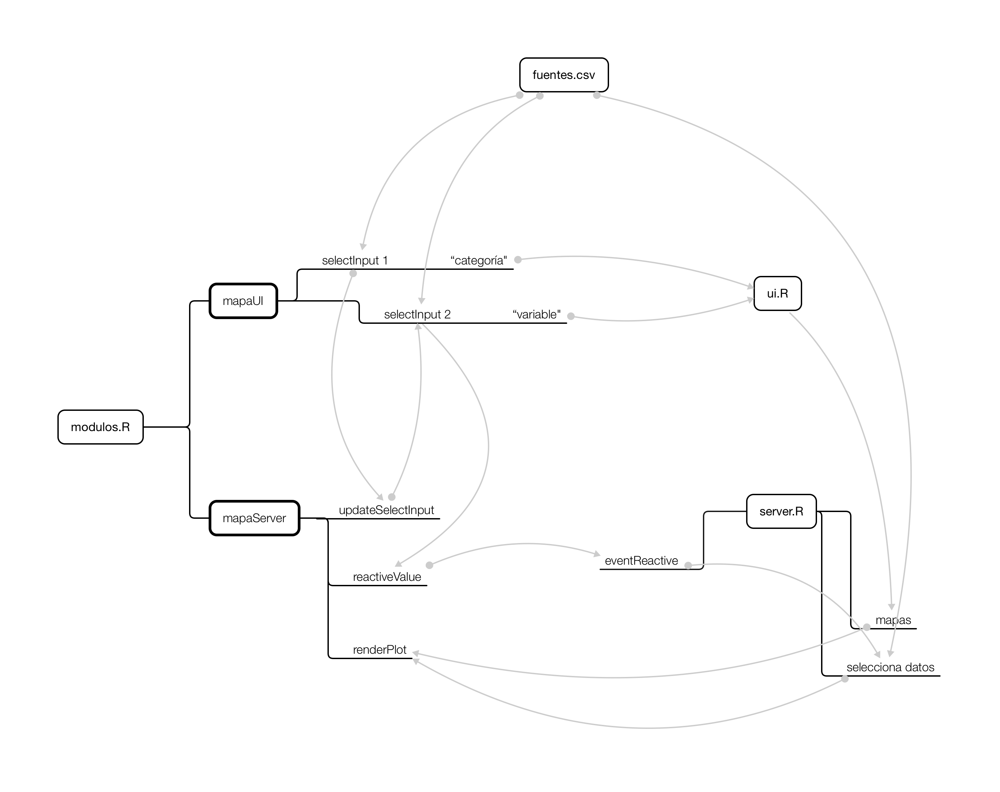

# Datos comunales comparados

Aplicación web interactiva desarrollada en R.

Esta aplicación permite visualizar interactivamente las **diferencias y desigualdades territoriales** de Chile a través de mapas.
    
Seleccione una región del país, y luego elija dos variables para compararlas a nivel comunal. Por defecto, la aplicación le mostrará categorías y variables al azar, esperando que surja una relación interesante."),
    
Se puede elegir entre más de 90 datos sociales, organizados en 10 categorías, que incluyen datos de salud, educación, ingresos, seguridad, delincuencia, urbanismo, y otros.

## Actualizaciones

**Changelog 20/06/24:**
- Agregadas 71 variables sobre desarrollo urbano desde datos del Sistema de Indicadores y Estándares de Desarrollo Urbano (SIEDU)
- Agregadas variables de cuarteles y comisarías de Carabineros (obtenida a través de la Plataforma de Datos Abiertos de Itrend)
- Corrección en cálculo de aumento de delitos y de población
- Unidades en algunas variables (especificando que se trata de metros cuadrados, kilowatts, etc.)
- Estabilidad con algunos casos de error comunes
- Cambios estéticos leves para mejorar contraste

## Aspectos metodológicos

La app contiene más de 90 variables individuales de datos a nivel comunal, las cuales provienen de fuentes oficiales, y que se detallan en la sección "Fuentes de los datos" y en el archivo `app/fuentes.csv`. Cada dato disponible en la aplicación posee su fuente oficial detallada debajo de cada mapa.

## Aspectos técnicos

Se trata de una aplicación web desarrollada en el lenguaje de programación estadístico R, usando el framework para aplicaciones estadísticas interactivas Shiny. Todas las librerías son de código abierto.

Desarrollé la aplicación para aplicar el mapa urbano de la Región Metropolitana que detallé en un tutorial previo, y para aprender el uso de módulos en Shiny.

El aspecto de los datos de la aplicación son controlados por una [planilla llamada `fuentes.csv`](https://github.com/bastianolea/comparador_mapas_chile/blob/main/app/fuentes.csv), donde cada fila es una variable posible de visualizar en la app, y que detalla los metadatos de cada variable, como su categoría, su nombre, el nombre del objeto a cargar por la app, la escala de la variable (si es porcentaje, numero decimal o numero grande, para adecuar los gráficos), y la fuente del dato. Desde esta planilla se generan automáticamente las categorías y se rellenan los selectores de la app, facilitando el proceso de agregar o modificar variables nuevas para visualizarlas.

## Fuentes de los datos

**Indicadores y Estándares de Desarrollo Urbano:** [Sistema de Indicadores y Estándares de Desarrollo Urbano (SIEDU).](https://www.ine.gob.cl/herramientas/portal-de-mapas/siedu). Datos limpiados y procesados en el repositorio [indicadores_urbanos_siedu](https://github.com/bastianolea/indicadores_urbanos_siedu).

**Cuarteles de Carabineros:** [Plataforma de Datos Abiertos de Itrend](https://www.plataformadedatos.cl) (Instituto para la Resiliencia ante Desastres). Carabineros de Chile, «Cuarteles de Carabineros». Obtenida a través de la Plataforma de Datos Abiertos de Itrend. Datos procesados en el repositorio [comisarias_chile](https://github.com/bastianolea/comisarias_chile)

**Estadísticas sobre delitos:** [Centro de Estudios y Análisis del Delito](https://cead.spd.gov.cl/estadisticas-delictuales/), código de scraping y procesamiento [disponible en el repo `delincuencia_chile`](https://github.com/bastianolea/delincuencia_chile), y también disponibles en detalle como aplicación web: [Estadísticas de delincuencia en Chile](https://bastianoleah.shinyapps.io/delincuencia_chile/)

**Resultados de los plebiscitos constitucionales:** [Servel](https://app.powerbi.com/view?r=eyJrIjoiNDI2ZWYxNmItYWIwNC00YzYzLWE1OTUtZTZhNjE5MWYzNDdlIiwidCI6ImVhZjg3OWJkLWQzZWMtNDY1MC1iMTI5LTEzZGZkZjQ4NTlmZSJ9), datos procesados en el [repositorio `plebiscitos_chile`](https://github.com/bastianolea/plebiscitos_chile)

**Estadísticas sobre resultados de prueba PAES:** [Mineduc](https://datosabiertos.mineduc.cl/pruebas-de-admision-a-la-educacion-superior/), código de procesamiento de la base de datos disponible en el repositorio [`puntajes_prueba_paes`](https://github.com/bastianolea/puntajes_prueba_paes)

**Pago de contribuciones por comuna:** SII, datos obtenidos y procesados por [Ernesto Laval](https://observablehq.com/@elaval/distribucion-de-pago-de-contribuciones-por-comuna)

**Datos municipales:** [Sistema Nacional de Información Municipal (SINIM)](https://datos.sinim.gov.cl/datos_municipales.php), datos procesados en el repositorio [`sinim_datos_comunales`](https://github.com/bastianolea/sinim_datos_comunales)

**Estadísticas socioeconómicas:** Encuesta CASEN 2022, datos procesados en el repositorio [`casen_relacionador`](https://github.com/bastianolea/casen_relacionador), y también disponibles en detalle como aplicación web: [Relacionador Casen](https://bastianoleah.shinyapps.io/casen_relacionador)

**Población y proyecciones:** INE, datos procesados en el repositorio [`censo_proyecciones_poblacion`](https://github.com/bastianolea/censo_proyecciones_poblacion), y también disponibles en detalle como aplicación web: [Censo de población: proyecciones](https://bastianoleah.shinyapps.io/censo_proyecciones/)

## Pendientes

- Datos sobre género
- Datos sobre femicidios
- Datos sobre pago de contribuciones
- Colores a los mapas según categoría
- Índice de desarrollo humano
- Indicar unidades de las variables